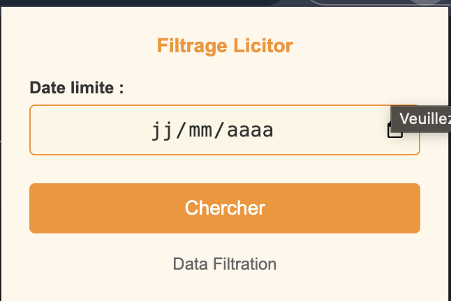
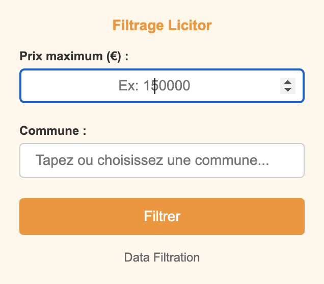

# FiltrageLicitor

**Extension web permettant de filtrer les ventes aux enchères immobilières sur le site [Licitor](https://www.licitor.com).**

## 🚀 Fonctionnalités
- Filtrage par **date limite**.
- Filtrage par **prix maximum (€)**.
- Filtrage par **commune**.
- Affichage des annonces correspondantes sous forme de liens cliquables vers le site officiel.
- Interface simple et intuitive (popup intégré à l’extension).

## 🛠️ Technologies utilisées
- **JavaScript** : logique de filtrage et communication entre les composants.
- **HTML/CSS** : interface utilisateur (popup).
- **Chrome Extension API** : intégration et communication avec le navigateur.
- **Architecture MVC** : 
  - **Model** → gestion des données (annonces, filtres).  
  - **View** → interface popup et affichage des résultats.  
  - **Controller** → gestion de la logique métier et interactions utilisateur.  

## 📷 Aperçu
### 1. Interface de recherche par date
<p align="center">
  
</p>

### 2. Recherche avec prix et commune
<p align="center">
  
</p>

### 3. Résultats affichés
<p align="center">
  
</p>

## 📦 Installation
1. Télécharger le projet ou cloner le dépôt :
   ```bash
   git clone https://github.com/elouarddine/FiltrageLicitor.git
